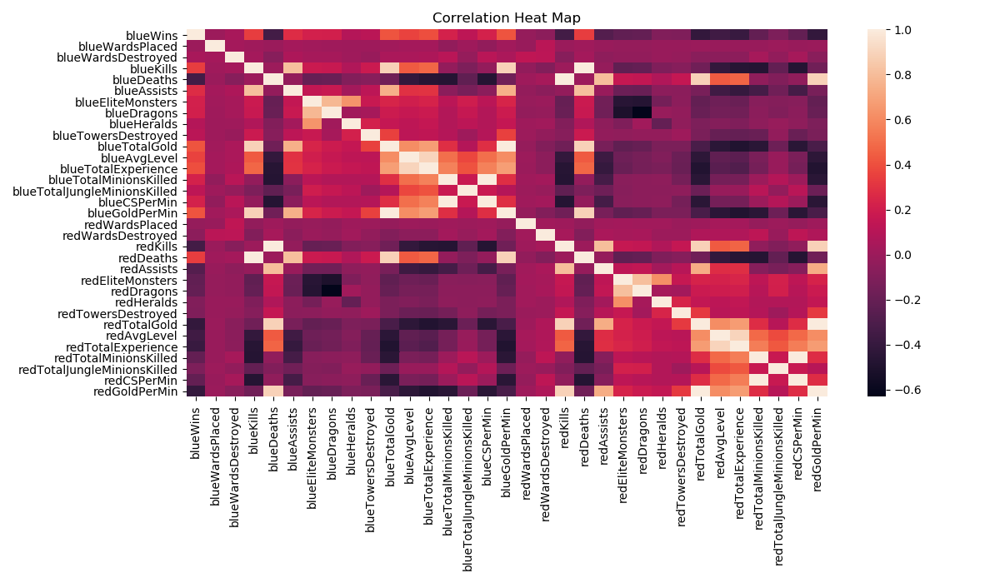
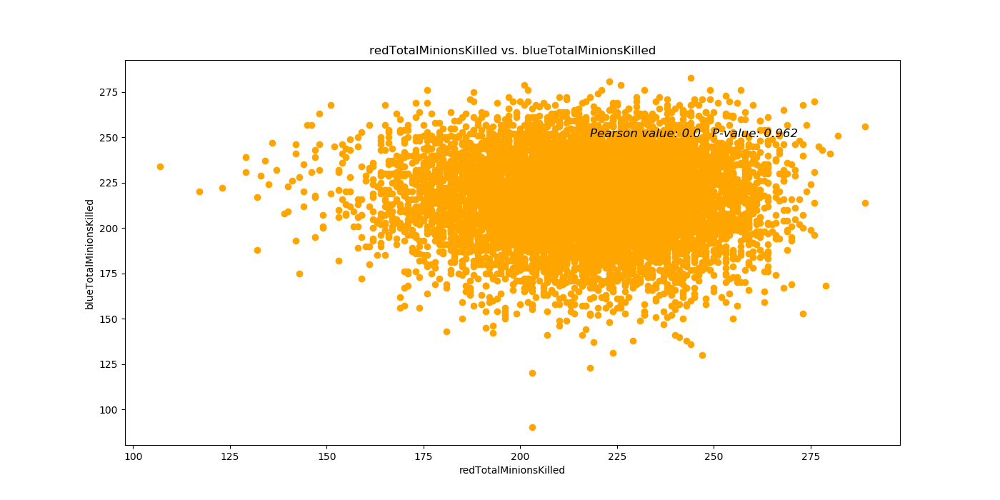
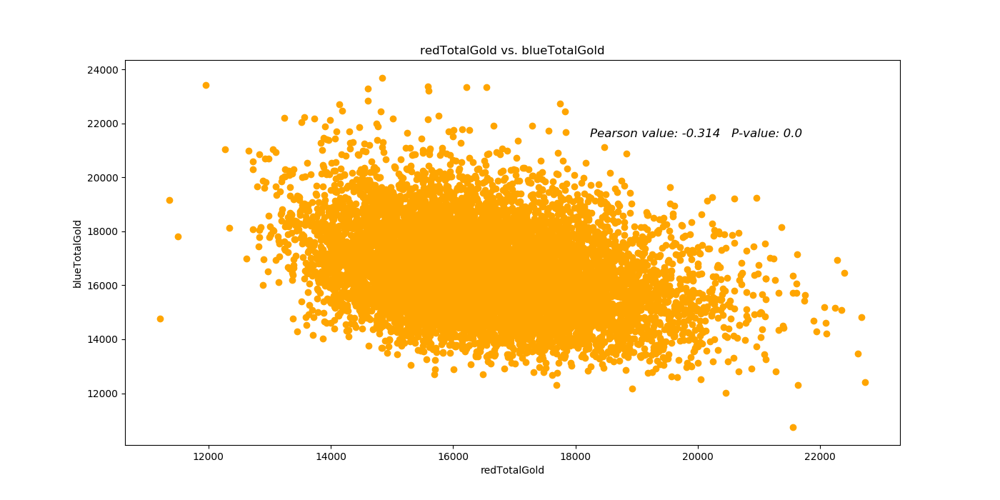
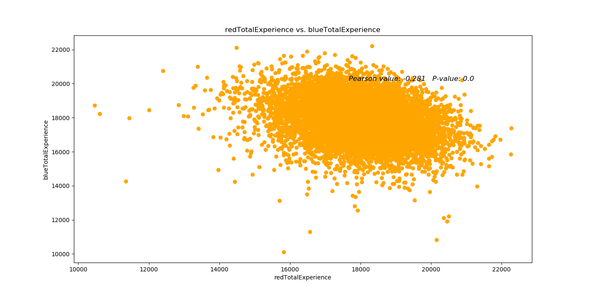
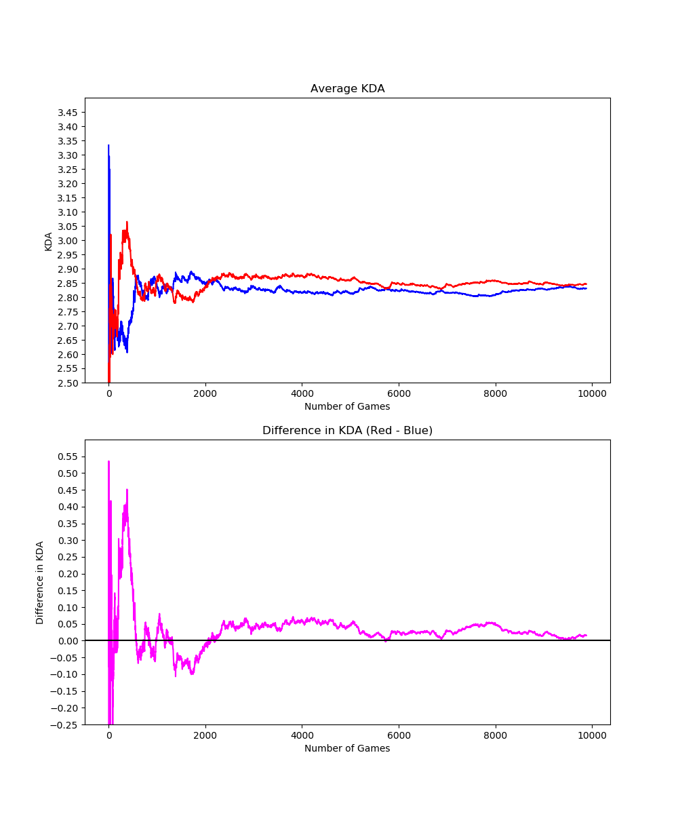
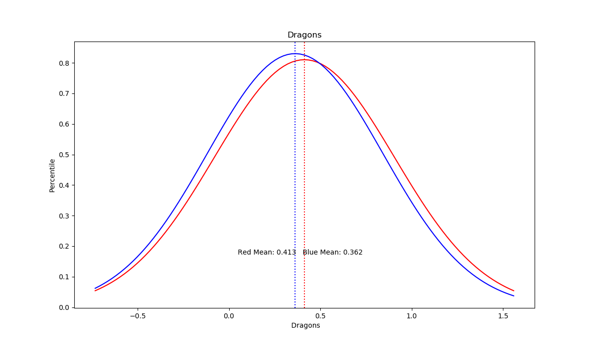
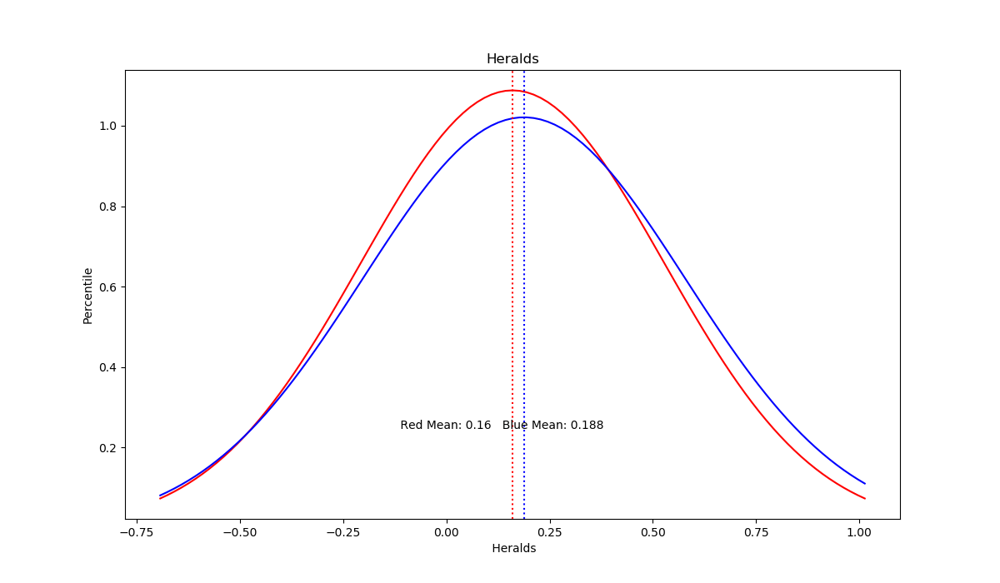
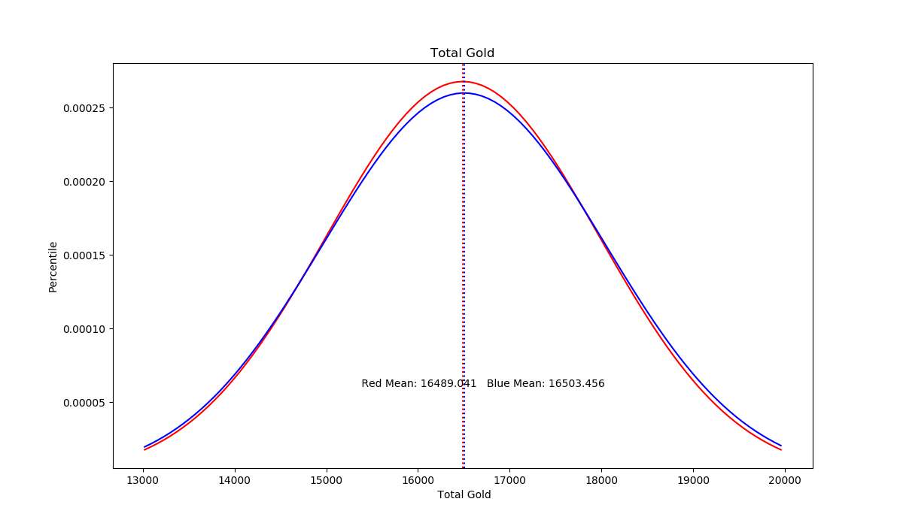

# League of Legends Win Likelihood
 

In my capstone, I will be using a League of Legends database from kaggle.com describing top players' game statistics for over 10k games.  This dataset can be found at https://www.kaggle.com/bobbyscience/league-of-legends-diamond-ranked-games-10-min.  I would like to explore the data to find relationships between various statistics and if there are any inherent advantages for either team.

Some of the factors I intend to examine include the team color(red vs blue) as the gameplay can vary depending on side, and advantages through resources gained in the first 10 minutes of the game.  It is expected that increased resources(gold, minions, objectives) would result in a higher chance of winning the game but my analysis would like to determine which have the greatest impact on the game.

## First of all, What is League of Legends?
League of Legends is one of the most popular games in the world with roughly 80 million monthly players. In the game, two teams of five players work together to destroy the base of the enemy team.  Throughout the game, players will gain gold through various ways such as killing minions or defeating large objectives such as dragons and barons.  Gold allows players to buy items that make their champion even stronger.

## The factors I intend to examine are:
1. Assists 
2. Average Level
3. CS Per Min
4. Deaths
5. Dragons
6. Elite Monsters
7. Experience Differential
8. First Blood
9. Gold Differential
10. Gold Per Min
11. Heralds
12. Kills
13. Total Experience
14. Total Gold
15. Total Jungle Minions
16. Total Minions Killed
17. Towers Destroyed
18. Wards Destroyed
19. Wards Placed

All of the values in the dataset are numerical allowing me to insert my desired columns into the ideal format(panda dataframe). 

|    |      gameId |   blueWins |   blueWardsPlaced |   blueWardsDestroyed |   blueFirstBlood |   blueKills |   blueDeaths |   blueAssists |   blueEliteMonsters |   blueDragons |   blueHeralds |   blueTowersDestroyed |   blueTotalGold |   blueAvgLevel |   blueTotalExperience |   blueTotalMinionsKilled |   blueTotalJungleMinionsKilled |   blueGoldDiff |   blueExperienceDiff |   blueCSPerMin |   blueGoldPerMin |   redWardsPlaced |   redWardsDestroyed |   redFirstBlood |   redKills |   redDeaths |   redAssists |   redEliteMonsters |   redDragons |   redHeralds |   redTowersDestroyed |   redTotalGold |   redAvgLevel |   redTotalExperience |   redTotalMinionsKilled |   redTotalJungleMinionsKilled |   redGoldDiff |   redExperienceDiff |   redCSPerMin |   redGoldPerMin |
|---:|------------:|-----------:|------------------:|---------------------:|-----------------:|------------:|-------------:|--------------:|--------------------:|--------------:|--------------:|----------------------:|----------------:|---------------:|----------------------:|-------------------------:|-------------------------------:|---------------:|---------------------:|---------------:|-----------------:|-----------------:|--------------------:|----------------:|-----------:|------------:|-------------:|-------------------:|-------------:|-------------:|---------------------:|---------------:|--------------:|---------------------:|------------------------:|------------------------------:|--------------:|--------------------:|--------------:|----------------:|
|  0 | 4.51916e+09 |          0 |                28 |                    2 |                1 |           9 |            6 |            11 |                   0 |             0 |             0 |                     0 |           17210 |            6.6 |                 17039 |                      195 |                             36 |            643 |                   -8 |           19.5 |           1721   |               15 |                   6 |               0 |          6 |           9 |            8 |                  0 |            0 |            0 |                    0 |          16567 |           6.8 |                17047 |                     197 |                            55 |          -643 |                   8 |          19.7 |          1656.7 |
|  1 | 4.52337e+09 |          0 |                12 |                    1 |                0 |           5 |            5 |             5 |                   0 |             0 |             0 |                     0 |           14712 |            6.6 |                 16265 |                      174 |                             43 |          -2908 |                -1173 |           17.4 |           1471.2 |               12 |                   1 |               1 |          5 |           5 |            2 |                  2 |            1 |            1 |                    1 |          17620 |           6.8 |                17438 |                     240 |                            52 |          2908 |                1173 |          24   |          1762   |

## Correlation
The first image I would like to highlight is a correlation map of the various categories to get a sense of the data.

Although this may not be the clearest visualization, it does allow a general sense of the relationship between the red and blue team.  As expected, increased resources for one team appear to have a negative correlation for the other team.

Lets take a further look.

I ran a Pearson correlation test over the variables to determine the strength of the linear relationship.

Due to the lack of a linear relationship, these results suggest that the game is balanced and that both sides have an equal opportunity at obtaining the important resources in the game.

## Other Factors
Along with resources, a key component of success in the game is Player vs. Player combat.  The players fight against the enemy attempting to defeat them in order to get more gold.  The most common way to judge a player's proficiency in combat is the KDA ratio which is a combination of kills plus assists compared to deaths.

These results suggest that although relatively equal, the red team has a slight advantage in PVP combat.

## Can we believe this?
So far, it looks like both teams are evenly balanced.  To really determine this, I executed a T-test on the normal distribution of these variables obtaining these results:

|         Column                 |   T-stat |   P-value |
|:-------------------------|---------:|----------:|
| WardsPlaced              |   0.307  |    0.7589 |
| WardsDestroyed           |  -3.3151 |    0.0009 |
| FirstBlood               |  -1.3517 |    0.1765 |
| Kills                    |  -1.0937 |    0.2741 |
| Deaths                   |   1.0937 |    0.2741 |
| Assists                  |   0.2942 |    0.7686 |
| EliteMonsters            |   2.6025 |    0.0093 |
| **Dragons**                  |   **7.3841** |    **0**      |
| **Heralds**                  |  **-5.1825** |    **0**      |
| TowersDestroyed          |  -2.5557 |    0.0106 |
| **TotalGold**               |  **-0.6694** |    **0.5032** |
| AvgLevel                 |   2.1443 |    0.032  |
| TotalExperience          |   1.9698 |    0.0489 |
| TotalMinionsKilled       |   2.0863 |    0.037  |
| TotalJungleMinionsKilled |   5.6674 |    0      |
| GoldDiff                 |  -0.8258 |    0.4089 |
| ExperienceDiff           |   2.4609 |    0.0139 |
| CSPerMin                 |   2.0863 |    0.037  |
| GoldPerMin               |  -0.6694 |    0.5032 |

As we can see, the red team obtains more dragons while the blue team obtains more heralds.  This is an expected result due to the layout of the map.

The interesting observation here is that although there is a discrepancy in which team obtains each of the two major objectives, the total gold remains roughly equal suggesting that dragons and heralds are of equal power.

# Conclusion
League of Legends is a balanced game that does not offer a significant advantage to either team.  While there are some objectives that benefit one side over the other, the net result is equal.

